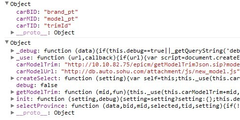

<body>

	

		<h1>CarSelect.js 汽车联动组件:</h1>
	
<!--end hd-->

<h2>演示：</h2>
	

	

		<table>
		<tr>
			<td style="text-align:right">
				<select id="brand_pt"></select>
				<select id="model_pt"></select>
				<select id="trimId"></select>
			</td>
		</tr>

		</table>
		 
	
<!--end demo-->

<!--end desc-->

<h2>参数说明:</h2>
	

<pre>
	<b>carBID</b>         : {string} Select品牌ID
	<b>carMID</b>         : {string} Select车型ID
	<b>carTID</b>         : {string} Select车款ID
	<b>selected</b>       : {object} 默认选中ID {bid:品牌,mid:车型,tid:车款}
	<b>fnSecond</b>       : {function} 自定义函数(二级)
	<b>fnThird</b>        : {function} 自定义函数(三级)
	<b>carModelUrl</b>	: {string} 品牌/车型 数据地址
	<b>carModelTrim</b>	: {string} 车款数据地址
	<b>debug</b>		: {boolean} debug开关
</pre>

<!--end desc-->

<h2>Demo1：二级联动</h2>

	

		<table>
		<tr>
			<td width="10%" style="text-align:right">演示: </td>
			<td width="90%"> <select id="dm1_1"></select> <select id="dm1_2"></select></td>
		</tr>
		</table>
		 
	
<!--end demo-->
	
<pre>
	CarSelect.init({
		carBID : 'dm1_1',
		carMID : 'dm1_2'
	});
</pre>

<!--end desc-->

<h2>Demo2：二级联动有默认选项</h2>

	

		<table>
		<tr>
			<td width="10%" style="text-align:right">演示: </td>
			<td width="90%"> <select id="dm2_1"></select> <select id="dm2_2"></select></td>
			
		</tr>
		</table>
		 
	
<!--end demo-->
	
<pre>
	CarSelect.init({
		carBID : 'dm2_1',
		carMID : 'dm2_2',
		selected : {
			bid : '207',
			mid : '2295'
		}
	});
</pre>

<!--end desc-->

<h2>Demo3：三级联动</h2>

	

		<table>
		<tr>
			<td width="10%" style="text-align:right">演示: </td>
			<td width="90%"> <select id="dm3_1"></select> <select id="dm3_2"></select> <select id="dm3_3"></select></td>
		</tr>
		</table>
		 
	
<!--end demo-->
	
<pre>
	CarSelect.init({
		carBID : 'dm3_1',
		carMID : 'dm3_2',
		carTID : 'dm3_3'
	});
</pre>

<!--end desc-->

<h2>Demo4：三级联动有默认选项</h2>

	

		<table width="100%">
		<tr>
			<td width="10%" style="text-align:right">演示: </td>
			<td width="90%"> <select id="dm4_1"></select> <select id="dm4_2"></select> <select id="dm4_3"></select></td>
		</tr>
		</table>
		 
	
<!--end demo-->
	
<pre>
	CarSelect.init({
		carBID : 'dm4_1',
		carMID : 'dm4_2',
		carTID : 'dm4_3',
		selected : {
			bid : '207',
			mid : '2295',
			tid : '119607'
		}
	});
</pre>

<!--end desc-->

<h2>Demo5：自定义 联动1</h2>

	

		<table>
		<tr>
			<td width="10%" style="text-align:right">演示: </td>
			<td width="90%"> <select id="dm5_1"></select> </td>
		</tr>
		</table>
		

	
<!--end demo-->
	
<pre>
	CarSelect.init({
		carBID : 'dm5_1',
		fnSecond: function(v, data){
			var html = '';
			if(data.length > 0){
				for(var i=0, ic=data.length; i<ic; i++){
						html += '<h5>'+data[i].n+'</h5>';
						if(data[i].b.length > 0){
							var loopData = data[i].b;
							html += '
';
							for(var k in loopData){
								html += '&lt;input type="radio" name="test" value="'+loopData[k].i+'" />'+loopData[k].n;
							}
							html += '
'
						}
				}
			}
			document.getElementById('mlist').innerHTML = html;
		}
	});
</pre>

<!--end desc-->

<h2>Demo6：自定义联动二</h2>

	

		<table>
		<tr>
			<td width="10%" style="text-align:right">演示: </td>
			<td width="90%"> <select id="dm6_1"></select> <select id="dm6_2"></select></td>
		</tr>
		</table>
		

	
<!--end demo-->

<pre>
	CarSelect.init({
		carBID : 'dm6_1',
		carMID : 'dm6_2',
		fnThird: function(v, data){
			var html = '';
			if(data.length > 0){
				for(var i=0,ic=data.length; i<ic; i++){
					html += '<input type="checkbox" value="'+data[i].id+'" />'+data[i].name;
				}
			}else{
				html = '';
			}
			
			document.getElementById('mlist2').innerHTML = html;
		}
	});
</pre>

<!--end desc-->

<h2>DEBUG 调试模式</h2>

	

		<table width="100%">
		<tr>
			<td width="10%" style="text-align:right">演示: </td>
			<td width="90%">方法一: CarSelect/index.html<b>?debug=true</b> 开启所有DEBUG</td>
		</tr>
		</table>
		

			
		

	
<!--end demo-->

<pre>
	方法二:开启单个联动debug
	CarSelect.init({
		carBID : 'dm6_1',
		carMID : 'dm6_2'
		
	},<b>true</b>);
</pre>

<!--end desc-->

<h2>CarSelect.js 源代码：</h2>

	
	
<pre style="overflow:hidden;overflow-x:scroll;">
/**
 * 三级联动公共组件
 *
 * @author [zhenwang@sohu-inc.com][2012-11-06] @fzxa
 * @editor [yy-mm-dd H:i:s][@author]
 * $Id: CarSelect.js 35 2012-11-06 11:44:37Z thriftwang@gmail.com $
 */

void (function(window, document, undefined){

	if (!(typeof CarSelect != 'undefined' && CarSelect)) {
		
		var CarSelect = window.CarSelect = {};
		
		/**
		 * 初始化CarSelect 
		 * @static
		 * @param  {object} setting 配置
		 * @param  {boolean} debug   
		 * @return {null}         
		 */
		CarSelect.init = function(setting, debug){
			
			setting = setting ? setting : {};

			this.debug = debug ? debug : false;
			//品牌/车型
			this.carModelUrl = setting.carModelUrl || 'http://db.auto.sohu.com/attachment/js/new_model.js';
			//正式接口
			//this.carModelTrim = setting.carModelTrim || ' http://db.auto.sohu.com/epicm/getModelTrimJson.sip?model=';
			//本地接口
			this.carModelTrim = setting.carModelTrim || 'http://10.10.82.75/epicm/getModelTrimJson.sip?model=';
			this.createSelect(setting);
			
			this._debug(setting);
			this._debug(this);
		}

		/**
		 * 创建Select选择框
		 *
		 * @param {object} [setting]
		 */
		CarSelect.createSelect = function(setting){

			var self = this;

			this._use( this.carModelUrl, function(){
				self._debug(brandMods);	
				if( typeof brandMods !== 'undefined' && brandMods.length >0 ){
					var bid = setting.carBID,
						mid = setting.carMID,
						tid = setting.carTID,
						selected = {
							adModelId : null,
							adBrandId : null
						};
					//选中条件ID判断	
					if(setting.hasOwnProperty('selected') == true){
						if(setting.selected.hasOwnProperty('bid') == true){
							selected.adModelId = setting.selected.bid;
						}
						if(setting.selected.hasOwnProperty('mid') == true){
							selected.adBrandId = setting.selected.mid;
						}
						//如果有车款ID则选中
						if(setting.selected.hasOwnProperty('tid') == true){
							self._use(self.carModelTrim + setting.selected.mid, function(){
								if(trimData.data.length > 0){
									var data = trimData.data;
									var tElem = document.getElementById(tid);
									if(tElem !== false && tElem !== null){
										tElem.innerHTML = '';
										var op = new Option("\u9009\u8f66\u6b3e", -1);
										tElem.options.add(op);
										for(var i =0, ic = data.length; i&lt;ic; i++){
											var op = new Option(data[i].name, data[i].id);
											tElem.options.add(op);
										}
										if(setting.selected.tid){
											tElem.value = setting.selected.tid;
										}else{
											tElem.value = '-1';
										}
									}
								}
							});
						}
					}

					new self.selectProvince(brandMods, bid, mid, selected, tid, setting);
				}
			});
		}
		
		/**
		 * 创建汽车联动
		 *
		 * @param {object} data 车型/品牌数据
		 * @param {string} bid  品牌id
		 * @param {string} mid  车型id
		 * @param {object} selected 默认选中项  adBrandId adModelId
		 * @param {string} tid  车款id
		 * @param {function} setting 自定义配置
		 * @return {null}
		 */
		CarSelect.selectProvince = function(data, bid, mid, selected, tid, setting){

			if(!data || data.length <=0)return false;

			this.data = data;
			this.b = $(bid);
			this.m = $(mid);
			this.t = $(tid);
			this.b.innerHTML = "";

			var op = new Option("\u9009\u54c1\u724c", -1);
			this.b.options.add(op);
			var len = this.data.length;
			var adBrandId = null; 
			var st = null; 
			var count = 1, index = "A";
			for (var i = 0; i < len; i++) {
				var bd = this.data[i];
				var op = new Option(bd.n, bd.i);
				if(index != bd.n.substring(0, 1)){
					count++;
					index = bd.n.substring(0, 1);
				}
				if(count%2 == 0){
					op.className = "s3";
				}
				this["k_" + bd.i] = this.data[i];
				this.b.options.add(op);
				if(selected.adModelId&&adBrandId==null){ 
					adBrandId = this.getBByM(bd,selected.adModelId);   
				} 
			}

			if (selected.adModelId) {this.b.value = selected.adModelId;}
			this.initsm(selected.adModelId,selected.adBrandId);
			
			var self = this;
			//二级联动
			this.b.onchange = function () {
					self.initsm(this.value, '' , setting);
			};
			
			//三级联动
			if(this.t !== false || setting.hasOwnProperty('fnThird') == true){
				this.m.onchange = function(){
					var _val = this.value;
					
					CarSelect.getModelTrim(_val, function(data){
						if(setting && setting.hasOwnProperty('fnThird') == true){
							setting.fnThird(_val, data);
							CarSelect._debug({"v":_val,"data":data});
						}else{
							self.t.innerHTML = '';
							var op = new Option("\u9009\u8f66\u6b3e", -1);
							self.t.options.add(op);
							var data = trimData.data;
							if(data.length > 0 ){
								for(var i=0, ic=data.length; i&lt;ic; i++){
									var op = new Option(data[i].name, data[i].id);
									self.t.options.add(op);
								}
							}
						}
						
					});
				}
			}

			function $(elem){
				var hasElem = document.getElementById(elem);
				if(hasElem !== null){
					return hasElem;
				}else{
					return false;
				}
			}
		}
		
		CarSelect.selectProvince.prototype = {

			getBByM : function(ds,adm){  
				  if(ds&&ds.s){  
						var len = ds.s.length;  
						for(var i=0;i&lt;len;i++){ 
							  var b = ds.s[i].b; 
							  var jlen = b.length;
							  for(var j=0;j&lt;jlen;j++){ 
									 if(adm==b[j].i){ 
										 return ds.i;   
									 }    
							  }
						 } 
				  } 
				  return null;
			},
			
			initsm:function (v,mv,setting) {
				
				if(this.m !== false){
					this.m.innerHTML = "";
					var op = new Option("\u9009\u8f66\u578b", -1);
					this.m.options.add(op);
				}
				if(this.t !== false){
					this.t.innerHTML = "";
					var op = new Option("\u9009\u8f66\u6b3e", -1);
					this.t.options.add(op);
				}
				
				if (!v || v == -1) {
					return;
				}
				var ds = this["k_" + v];
				if (ds && ds.s) {
					//二级自定义函数
					if(setting && setting.hasOwnProperty('fnSecond') == true){
							setting.fnSecond(ds, ds.s);
							CarSelect._debug({"v":ds,"data":ds.s});
					}else{
						var len = ds.s.length;
						for (var i = 0; i < len; i++) {
							var dss = ds.s[i];
							var group = document.createElement("optgroup");
							group.className = "s3";
							group.label = dss.n;
							this.m.appendChild(group);
							var b = dss.b;
							var jlen = b.length;
							for (var j = 0; j < jlen; j++) {
								var op = new Option(b[j].n, b[j].i);
								this.m.options.add(op);
							}
							if(mv)this.m.value = mv;
						}
					}
				}
			}
		}
		
		
		/**
		 * 车款三级联动
		 *
		 * @param {int} mid 车型ID
		 * @param {function} fun  自定义函数
		 * @return {object} data 车款
		 */
		CarSelect.getModelTrim = function(mid, fun){
		
			this._use(this.carModelTrim+mid, function(){
			
				var data = trimData.data;
				
				if(typeof fun == 'function'){
					fun(data);
				}else{
					return data;
				}
			});
			
		}
		
		
		/**
		 * DEBUG 模式
		 *
		 * @param {alltype} data LOG数据
		 * @return {null} 
		 */
		CarSelect._debug = function(data){

			if(this.debug == true || _getQueryString('debug') == 'true'){
				if( typeof console == 'object'){
					console.log(data);
				}else{
					return false; //暂时去掉IE Debug

				}
			}

			function _getQueryString(name) {
				var reg = new RegExp("(^|&)" + name + "=([^&]*)(&|$)", "i");
				var r = window.location.search.substr(1).match(reg);
			 	if (r != null) return unescape(r[2]); return null;
			}
		}

		/**
		 * 载入JS文件或者JSON数据
		 *
		 * @param {string} url 引入路径
		 * @parma {object} callback 回调方法
		 * @return {null}
		 */
		CarSelect._use = function (url, callback) {
			if (url) {
				var script = document.createElement('script');
				script.type = 'text/javascript';
				if (script.readyState) {
					script.onreadystatechange = function () {
						if (script.readyState == "loaded" || script.readyState == "complete") {
							script.onreadystatechange = null;
							callback && callback();
						}
					};
				} else {
					script.onload = function () {
						callback && callback();
					}
				}
				script.src = url;
				document.getElementsByTagName('head')[0].appendChild(script);
			}
		}

	}

})(this, document);
//end CarSelect.js
</pre>

<!--end desc-->

<h2>END</h2>
  

<a href="http://auto.sohu.com">2011-2012 auto.sohu.com </a>
  

<!--end doc-->

</body>
</html>